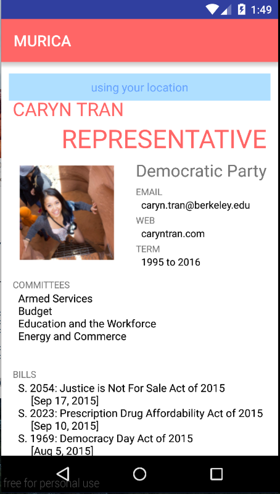

# PROG 02: Represent!

MURICA aims to provide an dead simple way for you to know and connect more with your goverment representatives and senator.
The phone and watch app combo provides an easy way for you get to know all the goverment officials you want!
Shake the watch to change to a random location. Never be bored again! This is a mockup of the phone to watch communication as well as the
basic layout of the app itself.

## Authors

Caryn Tran ([caryn.tran@berkeley.edu](mailto:caryn.tran@berkeley.edu))

## Demo Video

See [Prog 2B: MURICA MOCK] (https://youtu.be/iEsfbztFgbY)

## Screenshots

## Acknowledgments

* Hat tip to everyone on Stack Overflow and CS160 Staff for providing examples of watch phone communication
* Any other support
